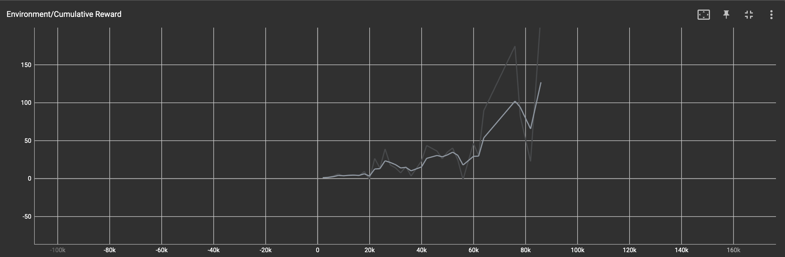
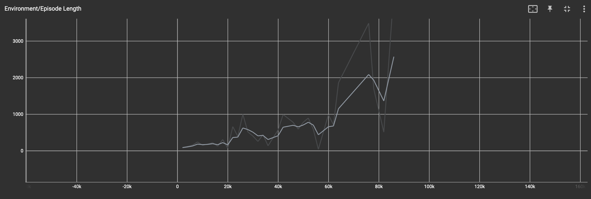

# Jumper Assignment

## Denkproces

Eerst ben ik begonnen met het opstellen van een arena met drie game objects; het platform, de speler en een spawner object.
Het platform zorgt voor een arena waar de speler zich op bevindt, de speler is de ‘cube’ dat wordt bestuurd door de AI en het spawner object is het originepunt vanwaar de obstakels vanuit verschillende snelheden en intervallen zullen spawnen.
Om het spawner object compleet te maken heb ik ook een aparte obstakel game object gemaakt met een trigger hitbox achter de balk dat de player een reward zal geven als deze veilig aan de overkant landt.

## Uitwerking

Wanneer dit uitgewerkt was trad een probleem op; de AI begon constant te springen om zo de balk te proberen vermijden.
Om dit gedrag tegen te werken wordt er een reward van -1 toegevoegd aan het totaal bij elke sprong.
Om tegen te gaan dat de speler constant (midden in de lucht) zou kunnen springen wordt er een raycast gedaan om te kijken of de speler ‘grounded’ (op de grond) is.

## Configuratie

De volgende configuratie wordt gebruikt:

```yml
behaviors:
  Jumper:
    trainer_type: ppo
    hyperparameters:
      batch_size: 10
      buffer_size: 100
      learning_rate: 0.0003
      beta: 0.0005
      epsilon: 0.2
      lambd: 0.99
      num_epoch: 3
      learning_rate_schedule: linear
      beta_schedule: constant
      epsilon_schedule: linear
    network_settings:
      normalize: false
      hidden_units: 128
      num_layers: 2
    reward_signals:
      extrinsic:
        gamma: 0.99
        strength: 1
    max_steps: 100000
    time_horizon: 64
    summary_freq: 2000
```

## Resultaten

Uiteindelijk na 80000 worden episode lengtes langer en langer tot er uiteindelijk (bijna) geen fouten meer gemaakt worden.



